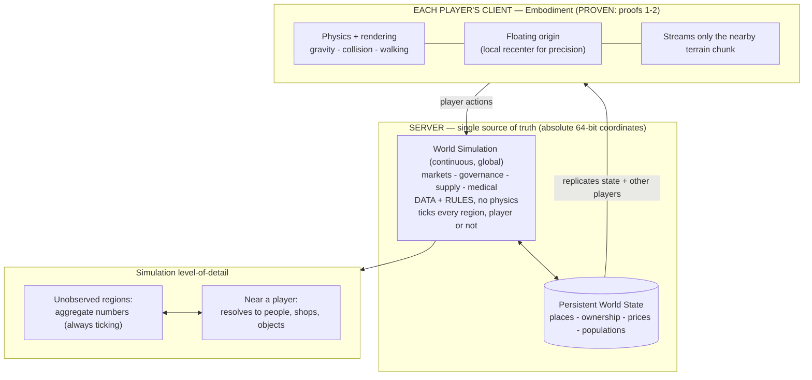

# WORLD MODEL — how a persistent, always-alive world fits together

**Status: forward-looking design target, NOT yet built.** This document records the
intended long-term architecture so the team shares one mental model. It does **not**
change the build order: the `CHARTER.md` proof sequence still governs what gets built
next, and world-systems work begins only after the planetary proofs pass and each
system is introduced explicitly, smallest-first (Growth + Assumption laws).

It exists to answer one real concern: *a world "based in reality" needs its systems —
markets, governments, medical, supply — to keep running everywhere, all the time, even
where no player is standing. Is that possible alongside the streaming physics we built?*

**Short answer: yes — because physics and world-simulation are two different engines.**

---

## The core principle: two decoupled layers

The single most important idea in this whole project:

| | **Embodiment layer** | **World-simulation layer** |
|---|---|---|
| What it is | A body touching geometry: gravity, collision, walking, rendering | The world's *systems*: economy, governance, supply, medical, populations |
| Made of | Physics engine + meshes | **Data + rules** (numbers and logic) — **no physics** |
| Runs where | Only **near each player** (streamed) | **Everywhere, globally, on the server** |
| Runs when | While a player is physically present | **Continuously, 24/7**, player present or not |
| Cost | Expensive per unit; must be local | Cheap per unit; scales across the planet |
| Status | **PROVEN** (CHARTER proofs 1–2) | **The next great frontier — unbuilt** |

The mistake to avoid is thinking the world only "lives" where the physics is loaded.
It doesn't. The physics is just the **window** a player walks through to touch a world
that is already alive in the simulation layer.

So: *"won't every moment need this physics to happen?"* — **No.** Constant world
activity is **simulation** (cheap, global, server-side), not **physics** (expensive,
local, embodied). A price moving, a shipment crossing an ocean, a hospital running low
— none of those touch the physics engine.

---

## How "always happening, simultaneously" actually works

A **server** holds the whole Earth as state (every region's economy, population,
supplies, political status, ownership, ...). On a schedule — a **world tick** (fast for
markets, slow for seasons) — it updates **all regions at once**:

- A change in one place (say a policy or a shortage) is **one variable changing**. It
  propagates through a graph of relationships (trade routes, supply chains, political
  ties) to connected regions, which propagate it onward. That is **state flowing
  through rules** — cheap computation, not physics — and it happens **continuously and
  globally** whether or not anyone is watching.
- A player elsewhere later sees the **result**: prices moved, a good is scarce, the news
  reflects it. The cause-and-effect already happened in the simulation; the player
  observes the consequence when it reaches them.

This is not theoretical — it is how the most simulation-heavy games already work
(continuously-ticking server-side economies and world politics with no physics
involved), and it mirrors the real world, where markets, supply chains, and governments
are **information systems**: nobody simulates every atom of a country to model its
effect on global trade; it is modeled as state + rules.

---

## The scaling trick: simulation level-of-detail (LOD)

You cannot run *reality* — infinite detail everywhere is impossible for anyone. What is
achievable (and convincing) is **levels of detail**:

- **Everywhere, always:** every region ticks as **aggregate numbers** (a city = its
  population, economy, supply, health). The world is **never dead** — all of it updates.
- **Where a player is:** that aggregate **resolves** into individual people, shops, and
  objects you can physically touch. When the player leaves, it **folds back** into
  numbers, keeping the net effects.

So the world is *always alive and causally connected*, and full fidelity *materializes
where it is observed*. "The small things keep happening" is true at the systems level;
"every blade of grass simulated everywhere" is impossible and unnecessary.

---

## Multiplayer & authority

- **One shared, server-authoritative world.** The server is the single source of truth
  for terrain, ownership, prices, and where every player is. Clients never disagree
  about the world because they all read from it.
- **Two players in the same place** stream the **same** chunk and see the **same** state
  and **each other** (the server replicates positions/actions).
- **The floating origin is a per-client rendering trick only.** Each machine quietly
  recenters its own view so the math stays precise; over the network everyone uses the
  same **absolute, high-precision (64-bit) coordinates**. Your position means the same
  thing to the server and to every other player.

---

## Why the proven foundation already supports this

What we built is the **embodiment layer** and the precision spine underneath it:

- Earth-scale body at a documented radius (proof 1).
- Radial gravity + a player standing and moving with correct local up (proof 2),
  using a **floating origin** (client-local recentering) and **local collision patches**
  (the first step of terrain streaming).
- These rest on **double-precision planetary coordinates** — exactly the absolute,
  high-precision coordinate space that large-scale multiplayer worlds run on.

None of this conflicts with the simulation layer; it is the necessary physical base the
simulation is observed *through*. See `PLANETARY_PROOF.md` for the evidence.

---

## Honest scope & risks (no overselling)

- The world-simulation layer is a **massive, long-horizon effort** — arguably the most
  ambitious part of the project. It is largely **server-side software/data** (databases,
  simulation loops, networking), mostly **outside** Unreal's physics.
- It is a **known category** of problem (continuous distributed simulation), not a
  physics impossibility — but it must be designed deliberately and grown one system at a
  time.
- **"Literally real everywhere at once" is not achievable** by anyone. The target is a
  **convincing, always-on, causally-connected** simulation via aggregation/LOD.
- **Floating origin + networking is genuinely hard** (keep the network in absolute
  coordinates while each client recenters locally). It is solved in shipped large-world
  games, but needs careful design when we reach it.

---

## Architecture at a glance

---

## Build-order boundary (so this doc never becomes a license to skip ahead)

This is a *map of the destination*, not a work order. Per `CHARTER.md`:
1. Finish the planetary proofs first (roam the sphere; surface→atmosphere→space;
   a second body).
2. Then introduce world-systems **explicitly and smallest-first** — e.g. the
   `START_HERE_FOR_JARON.md` seed: *one place, one store, one item, one owned plot, one
   placed object* — each as its own verified slice, server-side state from day one so it
   is multiplayer-ready by construction.
3. Do not build the full simulation at once. Earn each system through a working layer.
